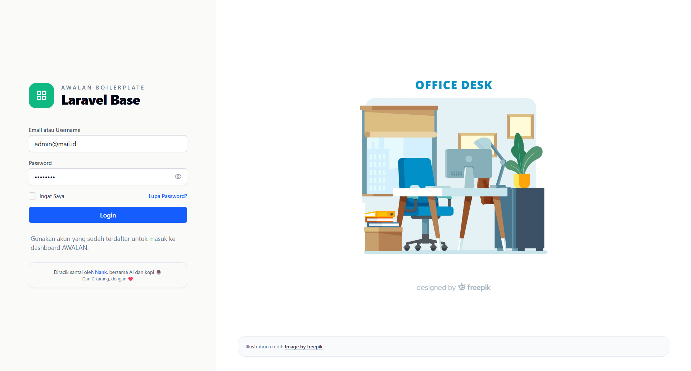

# AWALAN — Laravel Boilerplate · Admin Panel Starter Kit

[](https://laravel.com)
[](https://php.net)
[](https://tailwindcss.com)
[](LICENSE)

Laravel boilerplate siap pakai untuk admin panel dan starter kit project baru. Dilengkapi autentikasi, otorisasi berbasis role-permission, user management, menu management, company settings, dan arsitektur service layer — supaya tim bisa langsung fokus ke fitur bisnis tanpa setup dari nol.

Setiap project punya titik mulai, dan *awalan* adalah titik itu. Setiap project yang lahir dari *awalan* punya akar yang sama, tapi tumbuh ke arahnya sendiri.

## Cocok Dipakai Untuk

- Starter Laravel buat admin panel internal
- Fondasi aplikasi yang sudah ada role dan permission
- Template arsitektur service layer buat tim developer
- Baseline project yang folder, helper, dan dokumentasinya sudah rapi dari awal

## Fitur Bawaan

- Authentication admin
- Dashboard admin
- Profile management
- User management
- Role management
- Permission management
- Company settings
- Dynamic menu structure

Modul-modul ini bisa dipakai sebagai referensi implementasi sekaligus titik start buat nambah fitur baru.

## Preview

### Login



### Dasbor


### Pengguna


### Perusahaan


## Tech Stack

| Area | Stack |
|------|-------|
| Backend | PHP 8.2+, Laravel 12 |
| Frontend | Blade, Tailwind CSS 3, Vite 6, Axios |
| UI Utility | KTUI, Tabler Icons |
| Authentication | Laravel Sanctum |
| Authorization | Spatie Laravel Permission |
| Database | MySQL 8.0+ |
| Cache | Database driver |
| Queue | Database driver |
| Testing | PHPUnit 11 |
| Code Style | Laravel Pint |

## Quick Start

```bash
# Clone repository
git clone https://github.com/NankDanu/awalan
cd awalan

# Install dependency
composer install
npm install

# Setup environment
copy .env.example .env
php artisan key:generate

# Setup database
php artisan migrate --seed
php artisan storage:link

# Jalankan aplikasi
php artisan serve
npm run dev
```

Default akun hasil seeding:

- Admin: `admin@mail.id` / `password`
- User: `user@mail.id` / `password`

Endpoint utama:

- Login: `/` atau `/login`
- Dashboard: `/admin/dashboard`

## Struktur Proyek

```text
app/
├── Helpers/              # Helper global dan utilitas aplikasi
├── Http/
│   ├── Controllers/      # Controller untuk request/response
│   ├── Middleware/       # Middleware aplikasi
│   └── Requests/         # Form request untuk validasi
├── Models/               # Eloquent models
├── Observers/            # Observer untuk side effect seperti cache invalidation
├── Providers/            # Service provider
└── Services/             # Business logic utama

database/
├── factories/            # Factory untuk testing dan seeding
├── migrations/           # Migration dengan konvensi prefix tabel
└── seeders/              # Seeder data awal

docs/                     # Dokumentasi proyek dan modul
resources/
├── css/                  # Asset CSS
├── js/                   # Asset JavaScript
└── views/                # Blade views

src/
└── Modules/              # Placeholder untuk modul package (simpen .gitkeep)

routes/
└── modules/              # Placeholder route per modul (simpen .gitkeep)

database/
└── migrations/modules/   # Placeholder migration per modul (simpen .gitkeep)

resources/
└── views/modules/        # Placeholder view per modul (simpen .gitkeep)

resources/
└── views/_archive/       # Arsip/legacy view, bukan bagian runtime modul aktif

routes/
├── api.php               # API routes
├── console.php           # Console routes
└── web.php               # Web routes
```

Catatan struktur modul:
- Folder placeholder modul resmi: `src/Modules`, `routes/modules`, `database/migrations/modules`, `resources/views/modules`.
- Folder `resources/views/_archive` dipertahankan sebagai arsip referensi, tidak dipakai sebagai struktur modul aktif.

## Konvensi Tabel

AWALAN pakai prefix nama tabel buat ngebedain domain data:

| Prefix | Keterangan |
|--------|-----------|
| `mt_` | Master data |
| `tx_` | Transaksi |
| `cf_` | Konfigurasi |
| `sy_` | Sistem |

Contoh implementasi yang sudah ada: `mt_users`, `mt_menus`, `cf_company_settings`, `sy_roles`, `sy_permissions`, `sy_sessions`.

## Development

- Controller tetap sederhana dan fokus ke alur request/response.
- Business logic ditaruh di service layer.
- Validasi pakai form request.
- Akses data konfigurasi bisa dibantu lewat helper.
- Side effect kayak cache invalidation di-handle lewat observer kalau memang perlu.

Penjelasan yang lebih detail bisa langsung dilihat di [docs/DEVELOPMENT.md](docs/DEVELOPMENT.md). Semua dokumentasi project ada di folder [docs/](docs/) — mulai dari [docs/INDEX.md](docs/INDEX.md).

## Lisensi

MIT License

---

*Diracik santai oleh Nank, bersama AI dan kopi ☕ dari Cikarang, dengan ❤️*

