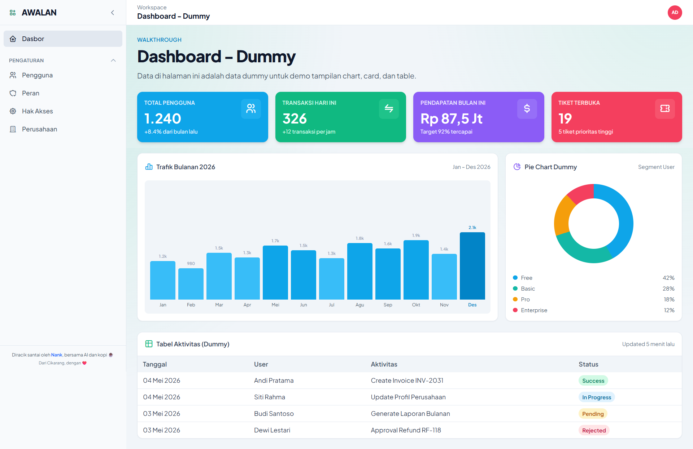
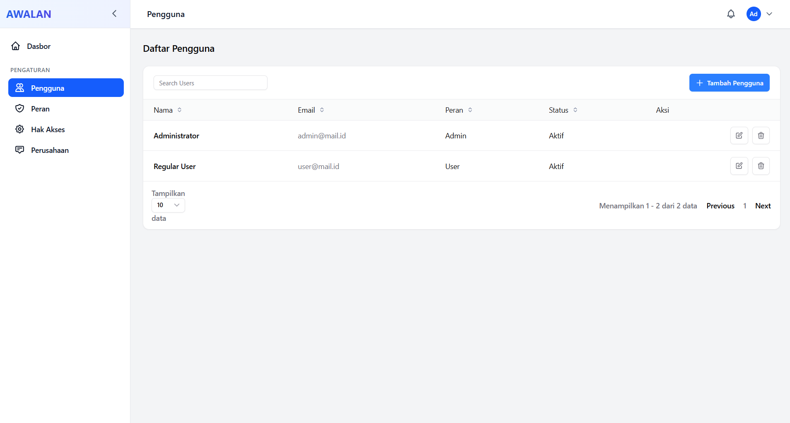
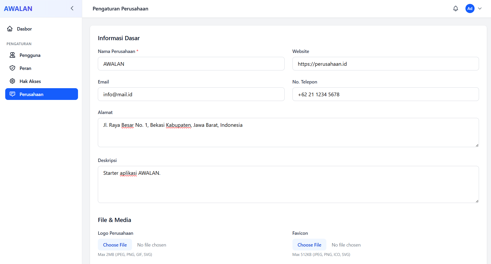

# AWALAN

[](https://laravel.com)
[](https://php.net)
[](https://tailwindcss.com)

AWALAN adalah `Laravel 12 boilerplate` untuk kebutuhan admin panel dan starter kit project baru. Repo ini disiapkan sebagai baseline aplikasi dengan autentikasi, otorisasi berbasis role-permission, user management, menu management, company settings, serta pola arsitektur service layer supaya tim bisa langsung lanjut ke fitur bisnis.

### Dasbor



### Pengguna



### Perusahaan



## Tech Stack

| Area | Stack |
|------|-------|
| Backend | PHP 8.2+, Laravel 12 |
| Frontend | Blade, Tailwind CSS 3, Vite 6, Axios |
| UI Utility | KTUI, Tabler Icons |
| Authentication | Laravel Sanctum |
| Authorization | Spatie Laravel Permission |
| Database | MySQL 8.0+ |
| Cache | Database driver |
| Queue | Database driver |
| Testing | PHPUnit 11 |
| Code Style | Laravel Pint |

## Modul

- Authentication admin
- Dashboard admin
- Profile management
- User management
- Role management
- Permission management
- Company settings
- Dynamic menu structure
- Modul contoh `Catat` (client/workspace/node)

Modul-modul ini bisa dipakai sebagai referensi implementasi sekaligus titik start buat nambah fitur baru.

## Quick Start

```bash
# Install dependency
composer install
npm install

# Setup environment
copy .env.example .env
php artisan key:generate

# Setup database
php artisan migrate --seed
php artisan storage:link

# Jalankan aplikasi
php artisan serve
npm run dev
```

Default akun hasil seeding:

- Admin: `admin@mail.id` / `password`
- User: `user@mail.id` / `password`

Endpoint utama:

- Login: `/` atau `/login`
- Dashboard: `/admin/dashboard`

## Struktur Proyek

```text
app/
├── Helpers/              # Helper global dan utilitas aplikasi
├── Http/
│   ├── Controllers/      # Controller tipis untuk request/response
│   ├── Middleware/       # Middleware aplikasi
│   └── Requests/         # Form request untuk validasi
├── Models/               # Eloquent models
├── Observers/            # Observer untuk side effect seperti cache invalidation
├── Providers/            # Service provider
└── Services/             # Business logic utama

database/
├── factories/            # Factory untuk testing dan seeding
├── migrations/           # Migration dengan konvensi prefix tabel
└── seeders/              # Seeder data awal

docs/                     # Dokumentasi proyek dan modul
resources/
├── css/                  # Asset CSS
├── js/                   # Asset JavaScript
└── views/                # Blade views

routes/
├── api.php               # API routes
├── console.php           # Console routes
└── web.php               # Web routes
```

## Konvensi Tabel

AWALAN pakai prefix nama tabel buat ngebedain domain data:

- `mt_` untuk master data
- `tx_` untuk transaksi
- `cf_` untuk konfigurasi
- `sy_` untuk sistem

Contoh implementasi yang sudah ada:

- `mt_users`
- `mt_menus`
- `cf_company_settings`
- `sy_roles`
- `sy_permissions`
- `sy_sessions`

## Dokumentasi

Semua dokumentasi project ada di folder [docs](docs/). Kalau baru pertama kali buka project ini, paling aman mulai dari [docs/INDEX.md](docs/INDEX.md).

## Penggunaan

Project ini cocok dipakai kalau kamu butuh:

- Starter Laravel buat admin panel internal
- Fondasi aplikasi yang sudah ada role dan permission
- Template arsitektur service layer buat tim developer
- Baseline project yang folder, helper, dan dokumentasinya sudah rapi dari awal

Hal yang biasanya dilakukan setelah clone boilerplate ini:

1. Sesuaikan nama aplikasi dan environment.
2. Cek modul bawaan mana yang mau dipakai, mana yang mau dibuang.
3. Tambahkan migration dan service baru sesuai domain bisnis utama project.
4. Sesuaikan menu, permission, dan seed data biar match sama kebutuhan aplikasi.

## Development

- Controller tetap tipis dan fokus ke alur request/response.
- Business logic ditaruh di service layer.
- Validasi pakai form request.
- Akses data konfigurasi bisa dibantu lewat helper.
- Side effect kayak cache invalidation di-handle lewat observer kalau memang perlu.

Penjelasan yang lebih detail bisa langsung dilihat di [docs/DEVELOPMENT.md](docs/DEVELOPMENT.md).

## Lisensi

MIT License

Kalau mau mulai baca dokumentasi, langsung buka [docs/INDEX.md](docs/INDEX.md).
